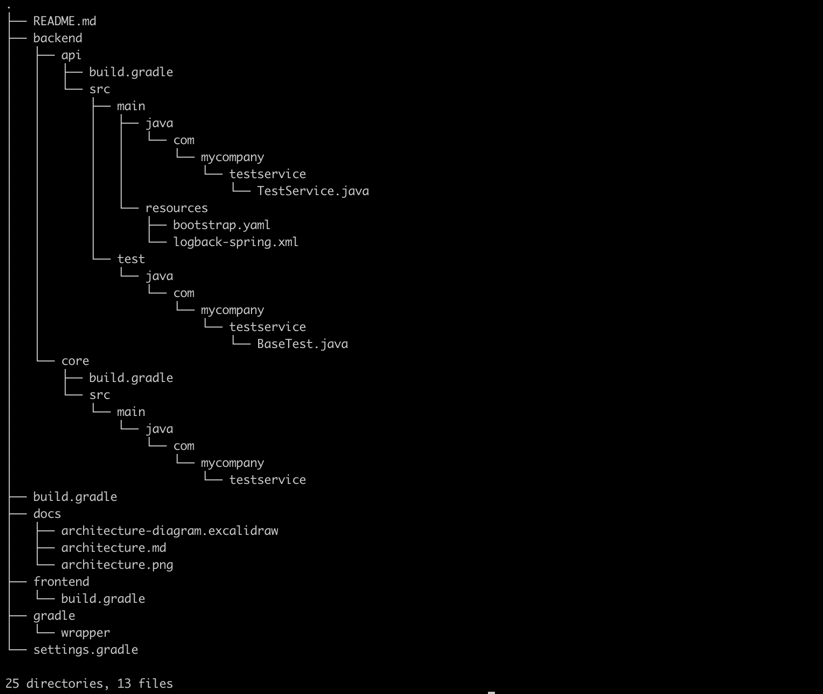

# spring-boot-base-gradle-template

### How to generate new service from the service template

Below command helps to generate a new service to provided servicepath  folder -

```sh
$ ./gradlew gradletemplate -Pservicepath=../../Projects -Pservicename=test-service -Pclassname=TestService -Pservicepackage=com/mycompany
```
`../../Projects` should be path where service should be created

`test-service` should be the name of service to be added

`TestService` sets the name of springboot application main class

`com/mycompany` sets the name of the package also referred as groupid

```sh
$ tree
```



          